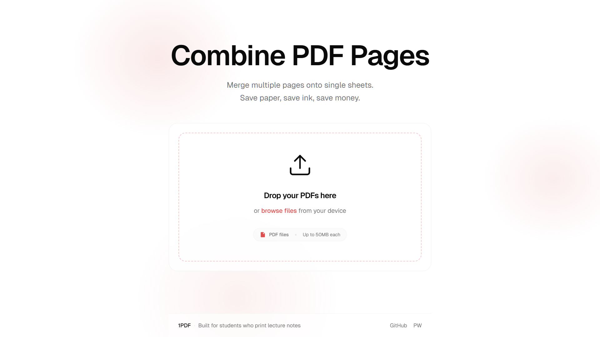

# 1PDF

<div align="center">
  
  
  ### **Combine PDF Pages | Save Paper | Save Money**
  
  <p><em>A modern web application for merging multiple PDF pages onto single sheets, built for students and professionals who want to optimize their printing.</em></p>

  <p>
    
    
    
    
  </p>

  <p>
    <a href="https://1pdf-app.vercel.app"></a>
    <a href="#pwa-installation"></a>
  </p>
</div>

---

## 💡 Why 1PDF?

<table>
<tr>
<td width="50%">

### **Perfect For**

- 🎓 **Students** printing lecture notes
- 💼 **Professionals** optimizing documents
- 🏢 **Offices** reducing paper costs
- 🌱 **Eco-conscious** users saving trees

</td>
<td width="50%">

### **Key Benefits**

- 💰 **Save up to 75% on printing costs**
- 🔒 **100% private** - no file uploads
- ⚡ **Lightning fast** browser processing
- 📡 **Works offline** as PWA

</td>
</tr>
</table>

## ✨ Features

<details>
<summary><b>Core Features</b></summary>

- 📄 **Smart PDF Combining** - Merge 2, 3, 4, or 6 pages per sheet
- 🎨 **Visual Customization** - Apply grayscale, color inversion, and background options
- 🎯 **Quality Control** - Adjustable DPI settings (150-300 DPI) for perfect print quality
- 🔄 **Drag & Drop Interface** - Intuitive file management with reordering capabilities
- ⚙️ **Real-time Processing** - Instant preview and processing feedback

</details>

<details>
<summary><b>Privacy & Security</b></summary>

- 🛡️ **Privacy First** - All processing happens locally in your browser
- 🚫 **No Uploads** - Your files never leave your device
- ✅ **Secure** - No server-side storage or data collection
- 🌐 **Offline Ready** - Works without internet connection when installed

</details>

<details>
<summary><b>Progressive Web App</b></summary>

- 📱 **Install on Any Device** - Works on desktop, mobile, and tablet
- 🎭 **App-like Experience** - Native feel with smooth animations
- 🔄 **Background Processing** - Continue processing when switching tabs
- 🔔 **Smart Notifications** - Get notified when processing completes
- 📴 **Offline Support** - Use the app without internet connection

</details>

## 📸 Screenshots

<div align="center">

### **Desktop Experience**

<table>
<tr>
<td align="center">

<br><em>Clean, modern interface for uploading PDF files</em>
</td>
<td align="center">

<br><em>Intuitive controls for configuring PDF settings</em>
</td>
</tr>
</table>

### **Mobile Experience**


<br><em>Responsive design optimized for mobile devices and touch interactions</em>

</div>

## 🚀 Quick Start

<details>
<summary><b>Prerequisites</b></summary>

- **Node.js 18+** or **Bun** runtime
- **Modern web browser** with PDF support (Chrome, Firefox, Safari, Edge)

</details>

### **Installation**

```bash
# Clone the repository
git clone https://github.com/mosaddiqdev/onepdf.git
cd onepdf

# Install dependencies
bun install
# or npm install

# Set up environment variables
cp .env.example .env.local

# Start development server
bun run dev
# or npm run dev

# Open your browser
# http://localhost:3000
```

<details>
<summary><b>Configuration Options</b></summary>

Environment variables can be configured in `.env.local`:

```env
# File size limits (in MB)
NEXT_PUBLIC_MAX_FILE_SIZE=50
NEXT_PUBLIC_MAX_TOTAL_SIZE=200

# Processing limits
NEXT_PUBLIC_MAX_FILES=20
NEXT_PUBLIC_MAX_PAGES_PER_FILE=500

# Timeout settings (in milliseconds)
NEXT_PUBLIC_PROCESSING_TIMEOUT=1800000
NEXT_PUBLIC_FILE_LOAD_TIMEOUT=60000
```

</details>

## 📱 PWA Installation

<div align="center">

### **Install 1PDF as an App**

<table>
<tr>
<td align="center" width="33%">
<h4>Desktop</h4>
Look for the install icon in your browser's address bar
</td>
<td align="center" width="33%">
<h4>Mobile</h4>
Use "Add to Home Screen" from your browser menu
</td>
<td align="center" width="33%">
<h4>Automatic</h4>
The app will prompt you to install after 30 seconds
</td>
</tr>
</table>

</div>

## 🛠️ Built With

<div align="center">

|    **Category**    |                  **Technology**                  |            **Purpose**            |
| :----------------: | :----------------------------------------------: | :-------------------------------: |
|   **Framework**    |        [Next.js 16](https://nextjs.org/)         |  React framework with App Router  |
|    **Language**    |  [TypeScript](https://www.typescriptlang.org/)   |       Type-safe JavaScript        |
|    **Styling**     |    [Tailwind CSS 4](https://tailwindcss.com/)    |    Utility-first CSS framework    |
| **PDF Processing** |        [PDF-lib](https://pdf-lib.js.org/)        |     PDF manipulation library      |
| **PDF Rendering**  |   [PDF.js](https://mozilla.github.io/pdf.js/)    |  Mozilla's PDF rendering engine   |
|   **Animations**   | [Framer Motion](https://www.framer.com/motion/)  | Smooth animations and transitions |
|  **File Upload**   | [React Dropzone](https://react-dropzone.js.org/) |      Drag & drop file upload      |
| **Notifications**  |     [Sonner](https://sonner.emilkowal.ski/)      |   Beautiful toast notifications   |

</div>

<details>
<summary><b>Project Structure</b></summary>

```
onepdf/
├── app/                    # Next.js App Router
│   ├── combine/           # PDF combining page
│   ├── layout.tsx         # Root layout with PWA setup
│   └── page.tsx          # Landing page
├── components/            # React components
│   ├── combine/          # Combine-specific components
│   ├── ui/               # Reusable UI components (shadcn/ui)
│   └── pwa/              # PWA components & install prompts
├── hooks/                # Custom React hooks
│   ├── use-processing.ts # PDF processing logic
│   ├── use-file-manager.ts # File management
│   └── use-background-notifications.ts # PWA notifications
├── lib/                  # Utility functions & core logic
│   ├── pdf-processor.ts  # Main PDF processing engine
│   ├── pdf-render.worker.ts # Web Worker for background processing
│   ├── validation.ts     # Input validation & sanitization
│   └── utils.ts         # General utilities
└── public/               # Static assets
    ├── icons/           # PWA icons & favicons
    ├── images/          # Screenshots & showcase images
    └── pdfjs/           # PDF.js worker & WASM files
```

</details>

## 🚢 Deployment

<details>
<summary><b>Vercel (Recommended)</b></summary>

1. **Push your code** to GitHub
2. **Connect your repository** to [Vercel](https://vercel.com)
3. **Deploy automatically** on every push

[](https://vercel.com/new/clone?repository-url=https://github.com/mosaddiqdev/onepdf)

</details>

<details>
<summary><b>Other Deployment Options</b></summary>

- **Netlify** - Connect GitHub repo for automatic deployments
- **Docker** - Use the included Dockerfile for containerized deployment
- **Self-hosted** - Deploy on any Node.js hosting provider

See [DEPLOYMENT.md](DEPLOYMENT.md) for detailed instructions.

</details>

## 🤝 Contributing

<div align="center">

**We welcome contributions from the community!**

<table>
<tr>
<td align="center">
<span>🐛</span>
<h4>Bug Reports</h4>
Found an issue? Let us know!
</td>
<td align="center">
<span>💡</span>
<h4>Feature Requests</h4>
Have an idea? We'd love to hear it!
</td>
<td align="center">
<span>🤝</span>
<h4>Code Contributions</h4>
Want to contribute code? Awesome!
</td>
</tr>
</table>

</div>

<details>
<summary><b>How to Contribute</b></summary>

1. **Fork the project**
2. **Create your feature branch** (`git checkout -b feature/AmazingFeature`)
3. **Commit your changes** (`git commit -m 'Add some AmazingFeature'`)
4. **Push to the branch** (`git push origin feature/AmazingFeature`)
5. **Open a Pull Request**

</details>

## License

This project is licensed under the **MIT License** - see the [LICENSE](LICENSE) file for details.

## Acknowledgments

### **Bug Reports & Community Feedback**

- **[Raghav Sharma](https://github.com/#)** - Reported critical background processing bug that led to implementing Web Worker architecture for uninterrupted PDF processing.
- **[Almas](https://github.com/#)** - Identified JPEG 2000 rendering issues with black/corrupted images, leading to implementation of proper WASM support for OpenJPEG decoding in PDF.js.

<div align="center">

---

### **⭐ this repo if you find it useful!**

<p>
  <a href="https://1pdf-app.vercel.app">Website</a> •
  <a href="https://github.com/mosaddiqdev/onepdf/issues">Report Bug</a> •
  <a href="https://github.com/mosaddiqdev/onepdf/issues">Request Feature</a> •
  <a href="https://github.com/mosaddiqdev/onepdf/discussions">Discussions</a>
</p>

**Built for students who print lecture notes**

</div>
