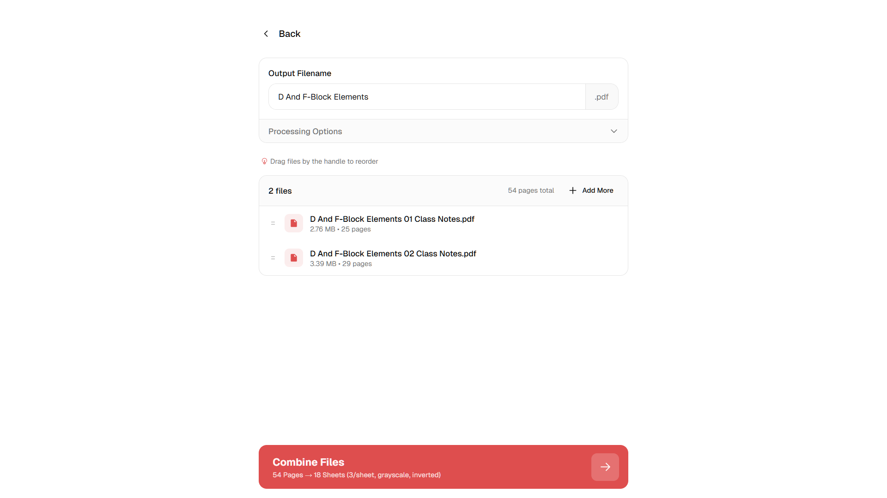
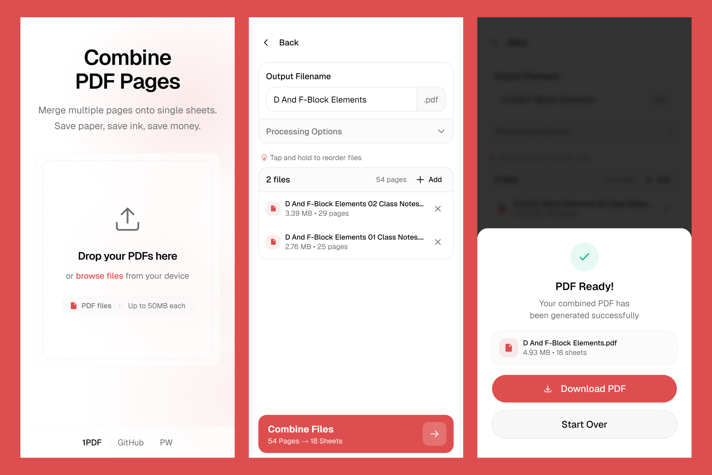

# 1PDF

<div align="center">
  
  
  **Combine PDF Pages | Save Paper | Save Money**
  
  A modern web application for merging multiple PDF pages onto single sheets, built for students and professionals who want to optimize their printing.

  [](https://nextjs.org/)
  [](https://www.typescriptlang.org/)
  [](https://tailwindcss.com/)
  [](https://web.dev/progressive-web-apps/)

  [🚀 Live Demo](https://1pdf-app.vercel.app) • [📱 Install as App](#installation)
</div>

## ✨ Features

- **📄 PDF Combining** - Merge multiple PDF pages onto single sheets (2, 4, 6, or 8 pages per sheet)
- **🎨 Visual Customization** - Apply grayscale filters and color inversion
- **📱 Progressive Web App** - Install on any device for offline-like experience
- **🖱️ Drag & Drop Interface** - Intuitive file management with reordering
- **⚡ Client-Side Processing** - All processing happens in your browser - no uploads
- **🔒 Privacy First** - Your files never leave your device
- **📊 Quality Control** - Adjustable DPI settings (72-300 DPI)
- **💾 Instant Download** - Get your combined PDF immediately

## 🖼️ Screenshots

<div align="center">
  
### Desktop Experience
 

*Clean, modern interface for uploading and managing PDF files* | *Intuitive controls for configuring PDF combination settings*

### Mobile Experience

<p><em>Responsive design optimized for mobile devices and touch interactions</em></p>

</div>

## 🚀 Quick Start

### Prerequisites

- Node.js 18+ or Bun
- Modern web browser with PDF support

### Installation

1. **Clone the repository**
   ```bash
   git clone https://github.com/mosaddiqdev/onepdf.git
   cd onepdf
   ```

2. **Install dependencies**
   ```bash
   bun install
   # or
   npm install
   ```

3. **Set up environment variables**
   ```bash
   cp .env.example .env.local
   ```

4. **Start development server**
   ```bash
   bun run dev
   # or
   npm run dev
   ```

5. **Open your browser**
   ```
   http://localhost:3000
   ```

## 🛠️ Built With

- **[Next.js 16](https://nextjs.org/)** - React framework with App Router
- **[TypeScript](https://www.typescriptlang.org/)** - Type-safe JavaScript
- **[Tailwind CSS 4](https://tailwindcss.com/)** - Utility-first CSS framework
- **[PDF-lib](https://pdf-lib.js.org/)** - PDF manipulation library
- **[PDF.js](https://mozilla.github.io/pdf.js/)** - PDF rendering engine
- **[Framer Motion](https://www.framer.com/motion/)** - Animation library
- **[React Dropzone](https://react-dropzone.js.org/)** - File upload component
- **[Sonner](https://sonner.emilkowal.ski/)** - Toast notifications

## 📱 PWA Installation

1PDF can be installed as a Progressive Web App on any device:

- **Desktop**: Look for the install icon in your browser's address bar
- **Mobile**: Use "Add to Home Screen" from your browser menu
- **Automatic**: The app will prompt you to install after 30 seconds

## 🔧 Configuration

Environment variables can be configured in `.env.local`:

```env
# File size limits (in MB)
NEXT_PUBLIC_MAX_FILE_SIZE=50
NEXT_PUBLIC_MAX_TOTAL_SIZE=200

# Processing limits
NEXT_PUBLIC_MAX_FILES=20
NEXT_PUBLIC_MAX_PAGES_PER_FILE=500

# Timeout settings (in milliseconds)
NEXT_PUBLIC_PROCESSING_TIMEOUT=1800000
NEXT_PUBLIC_FILE_LOAD_TIMEOUT=60000
```

## 🏗️ Project Structure

```
onepdf/
├── app/                    # Next.js App Router
│   ├── combine/           # PDF combining page
│   ├── layout.tsx         # Root layout
│   └── page.tsx          # Home page
├── components/            # React components
│   ├── combine/          # Combine-specific components
│   ├── ui/               # Reusable UI components
│   └── pwa/              # PWA components
├── hooks/                # Custom React hooks
├── lib/                  # Utility functions
│   ├── pdf-processor.ts  # PDF processing logic
│   ├── validation.ts     # Input validation
│   └── utils.ts         # General utilities
└── public/               # Static assets
```

## 🚀 Deployment

### Vercel (Recommended)

1. Push your code to GitHub
2. Connect your repository to [Vercel](https://vercel.com)
3. Deploy automatically on every push

### Other Platforms

See [DEPLOYMENT.md](DEPLOYMENT.md) for detailed deployment instructions for:
- Netlify
- Docker
- Self-hosted servers

## 🤝 Contributing

Contributions are welcome! Please feel free to submit a Pull Request.

1. Fork the project
2. Create your feature branch (`git checkout -b feature/AmazingFeature`)
3. Commit your changes (`git commit -m 'Add some AmazingFeature'`)
4. Push to the branch (`git push origin feature/AmazingFeature`)
5. Open a Pull Request

## 📄 License

This project is licensed under the MIT License - see the [LICENSE](LICENSE) file for details.

## 🙏 Acknowledgments

- Built with modern web technologies
- Inspired by the need for efficient PDF printing
- Designed for students and professionals

---

<div align="center">
  <p><strong>Built for students who print lecture notes</strong></p>
  <p>Made with ❤️ for better PDF management</p>
  <p>
    <a href="https://1pdf-app.vercel.app">Website</a> •
    <a href="https://github.com/mosaddiqdev/onepdf/issues">Report Bug</a> •
    <a href="https://github.com/mosaddiqdev/onepdf/issues">Request Feature</a>
  </p>
</div>